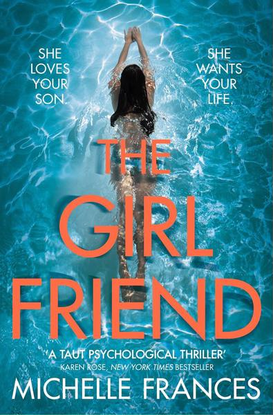
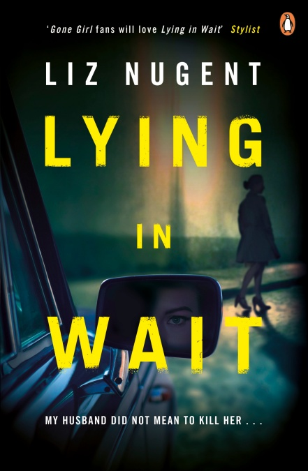

# Book reviews

I’ve had [mixed feelings about Goodreads ever since I joined it](https://medium.com/p/133b776bd468) towards the end of 2015. I’ve been feeling less antagonistic towards it since I ditched my author profile and reverted to a reader one. But really, the only reason I’ve stayed there is to preserve the reviews I’d already posted. It’s certainly not one of my favourite sites.

I recently noticed that I’ve effectively been boycotting Amazon without ever having made a deliberate decision to do that. I checked my “recent” orders and found that the last one was in November 2017. If I’m going to shun Amazon, it makes sense to avoid using their other sites too (within reason and not to the point of causing myself inconvenience). It would certainly be no sacrifice for me to stop using Goodreads.

I’d made previous attempts to free myself from the site’s clutches. Some time in 2017, I started to crosspost to a Google+ collection those GR reviews that I thought of as most significant. I found Google+ an excellent forum for book reviews, certainly better than for some other uses I tried to put it to. But now Google+ is going away.

Another Goodreads alternative I tried was [Litsy](https://www.litsy.com), an Instagramalike, photocentric app for bookworms. One thing I liked about Litsy is that it limits book reviews to around 450 characters. (I have to admit to a tendency to prolixity, given enough rope.) Unfortunately Litsy is a strictly iOS/Android app and, after a few months, I got rid of my Android phone. I’d thought I could continue to use the app on the iPad but it looks wrong somehow, too diffuse and out of proportion on the larger screen.

But now everything has changed. I have my own domain name and personal website. Surely that’s the right location for my reviews? So, over the next few months, I’ll copy those Goodreads reviews that I want to keep and put them on this site instead. I’ve downloaded my data from Google+ and I’ll start with the reviews that I crossposted there.

In the meantime, I’ve copied my Litsy reviews (which date from between roughly April and July 2018) and here they are:

[Emily Barr, _The Sisterhood_](https://www.emilybarr.com/books/the-sisterhood/)   
Some of the Goodreads reviews suggest that the prologue gives too much away. I completely disagree. I could hardly bear to read the tense, climactic encounter between Liz and Mary — I was becalmed 50 pages from the end for three days. If I hadn’t known what Helen didn’t know, I’d never have been able to finish. Also, I don’t think I’d have enjoyed the book as much without knowing what the prologue implies about Helen.

[Gianrico Carofiglio, _Temporary Perfections_](https://www.bitterlemonpress.com/products/temporary-perfections)   
The second book I’ve read from this series, which I seem to be navigating backwards, having started with the latest. I needed to adjust to the unspectacular quality of the plots: they aim not so much for surprise as at confirmating of your worst suspicions—and are not afraid of cliché. This one, in particular, reminded me of Simenon (well, actually of films based on Simenon, whose books I haven’t read for a very long time). The characters are fascinating, compelling and credibly flawed. They more than make up for the underpowered plot.   

[Gianrico Carofiglio, _A Fine Line_](https://www.bitterlemonpress.com/products/a-fine-line)   
I found this a bit disappointing (particularly given Scott Turow’s blurb!) though the first-person narrator and several other characters are really quite appealing. Advocate Guerrieri has no difficulty representing guilty defendants: after all, they’re entitled to a lawyer, like anyone else. But do those rules apply when his client, a judge facing trial for accepting bribes, is corrupting the justice system from the core? I think maybe I should give this a second chance but I’m not in any rush.

[Sarah Pinborough, _Behind Her Eyes_](https://www.theguardian.com/books/2017/jan/24/behind-her-eyes-sarah-pinborough-review)   
Even within 80 pages of the end, I was tempted to abandon this one. I’m glad I stayed with it. The ending is (among other things) grimly funny (kind of a satire on the fashion for extreme twists). Readers who like the kind of book this at first appears to be might not like the end much and vice versa. My view is that the ending made the first two-thirds worthwhile.

The book that _Behind Her Eyes_ reminds me most of is S J Watson’s _SecondLife_, though the _nature_ of the twist is quite different. If you hated _Second Life_, you probably won’t like this either. My [GR review of _Second Life_](https://www.goodreads.com/review/show/1734504511) will eventually be copied on to this site.

[William Trevor, _Felicia’s Journey_](https://www.penguinrandomhouse.com/books/305010/felicias-journey-by-william-trevor/9780140253603/readers-guide/)   
This short novel (213 pages) is 25 years old but I’d never read it till last year. William Trevor writes about casual cruelty and violence in a calm, understated, rueful style. I felt sympathy for the dull misery of Felicia’s marginalized life before, during and at the end of her journey yet somehow detached from it. (Yes, that’s part of the point.) The ending is great but I’m not quite persuaded it was worth the journey to get there. I’ll be reading it again eventually to see how my first impressions stand up, or don’t.

[Jillian Keenan, _Sex with Shakespeare_](https://slate.com/human-interest/2016/04/how-shakespeare-helped-a-writer-understand-her-need-for-spanking.html)   
This book is part personal memoir, part literary criticism and part argument about sexuality. Not a combination I remember having encountered before, it works just as well as I’d have expected—which is to say it works brilliantly. The first chapter opened my eyes to _A Midsummer Night’s Dream_ which had previously been one of my least favourite Shakespeare plays.

[Peter Abrahams, _End of Story_](https://www.harpercollins.com/9780061130342/end-of-story/)   
Ivy is a struggling author who takes a gig teaching creative writing in a prison. She believes one of her students to be a brilliant writer; he’s also a remorseless killer. Ivy isn’t sure she accepts that it’s possible to be a good writer and a bad man. The last sentence (6 words) chilled me and changed my perspective on the whole story.

[Michelle Frances, _The Girlfriend_](https://www.panmacmillan.com/authors/michelle-frances/the-girlfriend/9781509821525)   
DNF — at least so far. I put it aside over a year ago, a little more than a tenth of it read, and never resumed reading. It all seems a bit pointless: two women, the mother and girlfriend of a male character, don’t like each other. Earth shattering. If I ever do get back to it, I’ll have to start from the beginning because I won’t remember much.   

[Liz Nugent, _Lying in Wait_](http://www.liznugent.ie/lying-in-wait-page/)   
I was very favourably surprised by Liz Nugent’s second novel. It’s not a procedural as I expected, though it begins with the murder of a drug-addicted, part-time sex worker by an apparently respectable judge, from which starting point it quickly goes in unpredictable directions. The intricately constructed plot features grotesquely damaged characters doing vicious things to each other; they’re mostly unsympathetic but fascinating to watch.   

[Debbi Mack, _The Planck Factor_](http://www.debbimack.com/project/the-planck-factor/)   
- [ ] Given the title and the blurb, I was expecting something wilder and weirder, and some concepts that would challenge my idea of reality, but this turned out to be a disappointingly ordinary thriller. On the plus side, there’s a rather neat novel-within-a-novel structure with events in the outer story seeming to echo those in the inner one.