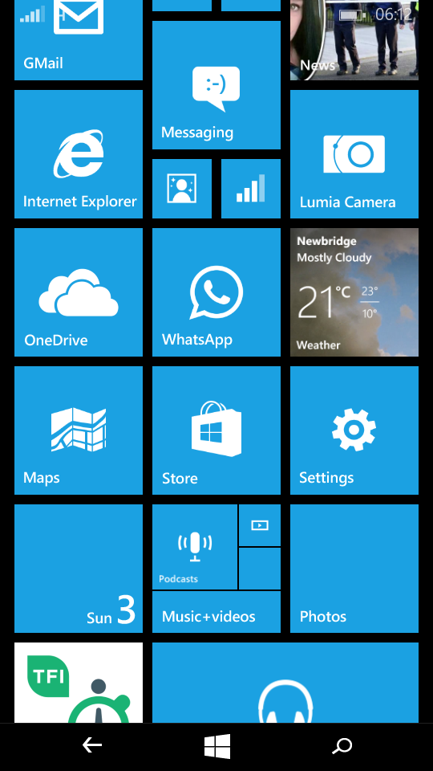
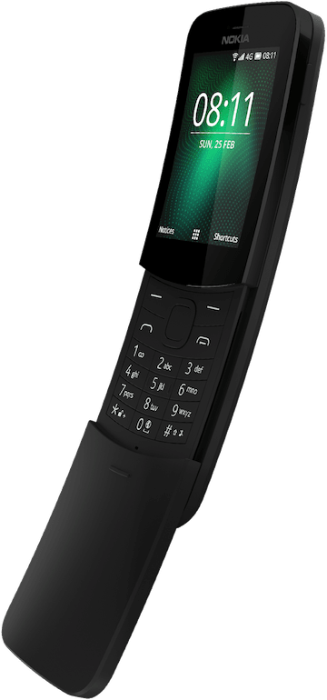

# The phone‘s not smart so you might have to be

For one reason or another I’m inclined to be hostile to the idea of smartphones. When Steve Jobs introduced the iPhone early in 2007, I was interested to see how it fared and wished it well but had no thought of getting one for myself. A few months later, he introduced the iPod Touch and I couldn’t wait to buy one. I’ve owned four different iPod Touches (and will very likely buy another at some point) and three iPads but I’ve still never had an iPhone.

People regularly complain about being overloaded with email. I listen to them in amusement because when I started work the method of communication that constantly interrupted our working day and caused productivity to plummet was the phone call. I’ll take email in preference any day. So I suppose I dislike smartphones simply because I don’t like _phones_. If you’re going to give me a pocketable device that incorporates email, a web browser, a camera, a media player and any number of internet-connected apps, I’d very much rather you didn’t throw in a phone as well. Of course, I still _need_ to carry a phone but ideally it should be a separate, inferior (and cheaper) device.

I didn’t own a smartphone till 2013, when I bought a Lumia 520. It was cheapish and I got it as an experiment, reasoning that I could dispose of it if it turned out to be unbearable to use. Three years later, I replaced it with another Lumia, this time a 535. The first one was branded Nokia, the second Microsoft, and they both ran on the Windows Phone operating system. As phones go, they were perfectly OK. I tended not to use the internet browser, which was clearly inferior to Safari on my iPad or iPod Touch (both of which could, however, connect to the internet using the phone’s data plan).

The things I _did_ use the phone for, as well as calls, were WhatsApp (which wouldn’t work without a phone) and Maps (to avoid pulling out the iPad while I was cycling or in circumstances where I was obviously lost). In other words, I didn’t _need_ most of the “smart” stuff.

Microsoft has discontinued support for Windows Phone (and the back of the 535 has cracked, meaning that an inordinate amount of dust gets in). It’s only a matter of time before I have to replace it. Last year, I briefly tried an Android phone (an Alcatel A3 XL). It had a much better camera than the Lumia (whose camera I didn’t use anyway, having an iPad), and lots more apps. But there were several usability gotchas, the most noticeable being that it would drop the internet connection while the iPad or one of my other computers was using it to get online. So I sold it, went back to the Lumia temporarily and resolved to get a Nokia 8110 4G as soon as they became available.

The 8110 (also known as the Banana phone) seemed ideally suited to my requirements. It has a web browser and a Twitter app (but because of the tiny screen, the temptation to use these is easy ro resist). It has Google Assistant, which I’ll try to remember to use only when connected to wifi. It doesn’t have WhatsApp yet (except in India) but I’m trying to move away from that anyway. What it does have is a 4G data connection which allows me to use it as a wireless hotspot.

I’m finding it hard to decide whether the Banana phone’s frustrations outweigh its advantages. For starters, it’s a bit of a gimmick: a near-replica of a phone that was a big hit in the 1990s. The slider is unnecessary and functions only to wake the phone/answer a call and put it to sleep/end call. Not the ideal use case for a flimsy piece of plastic which could easily break off. The battery life seems fine when I’m not using the phone as an internet hotspot but drains very fast when I’ve two or more devices connected to it. I end up charging it twice a day and a charge takes several hours.

More annoyingly, it sometimes seems unable to cope with acting as a hotspot at the same time as making or taking a voice call. I’m really not sure whether this is problem with the phone itself or with my service provider, so I’ve gone back to the Lumia 535 for a few days to see if I still have the same problem.

The 8110 is light and slim. It feels more like a phone in my hand than the Lumia’s flat rectangular slab does. (Given my antipathy to phones, perhaps that’s not such a good thing.) One of the reasons I wanted to get the Banana phone is that I’ve been missing T9 — as someone who learned to type on a manual typewriter while Jobs and Wozniak were still experimenting in an obscure garage, I find the idea of a QWERTY keyboard smaller than the width of two outstretched hands to be quite absurd. The irony is that the Nokia‘s implementation of T9 isn’t satisfactory unless you want to write in all lowercase (or unless I’m missing something that ought to be more obvious).

I don’t know yet whether I’m going to stick with the (definitely not smart but brighter than average) Nokia; I’ll decide in the next few days. If I conclude that it’s not worth the bother, I’ll probably end up continuing to use the Lumia till one of us stops working. 

 
